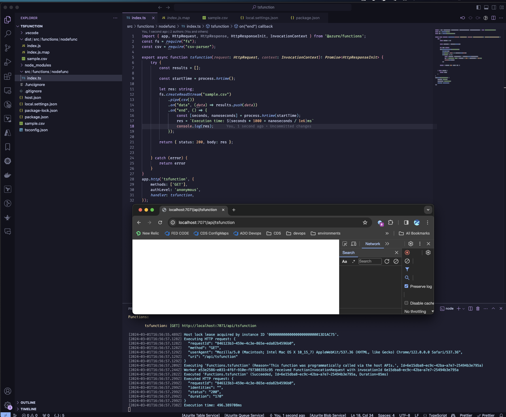

# Azure Function App Performance Comparison: Go vs TypeScript

This repository contains a performance comparison between a Go-based Azure Function App and a TypeScript-based Azure Function App. The purpose of this comparison is to illustrate the performance differences between the two implementations and to demonstrate why Go is an optimal choice for Azure Function Apps.

## Performance Screenshots

### Go Azure Function

### TypeScript Azure Function

## Overview

The Go-based Azure Function App has shown significantly better performance in terms of speed compared to the TypeScript-based Azure Function App. This repository contains the source code, test results, and performance metrics for both implementations.

## Contents

1. `go-function-app`: This directory contains the source code for the Go-based Azure Function App.
2. `ts-function-app`: This directory contains the source code for the TypeScript-based Azure Function App.

## Performance Comparison

The Go-based Azure Function App has shown to be faster than the TypeScript-based Azure Function App in our tests.

## Why Go?

Go is a statically typed, compiled language that is known for its simplicity and efficiency. It has a strong standard library and it's designed for concurrency, which makes it a great choice for cloud functions that need to be fast and efficient.

## Getting Started

To run the function apps locally, follow the instructions in the README files in the `go-function-app` and `ts-function-app` directories.